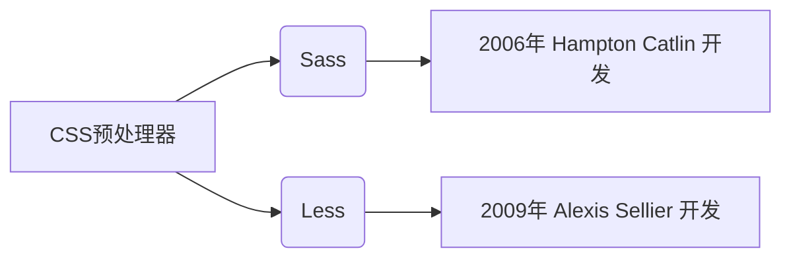
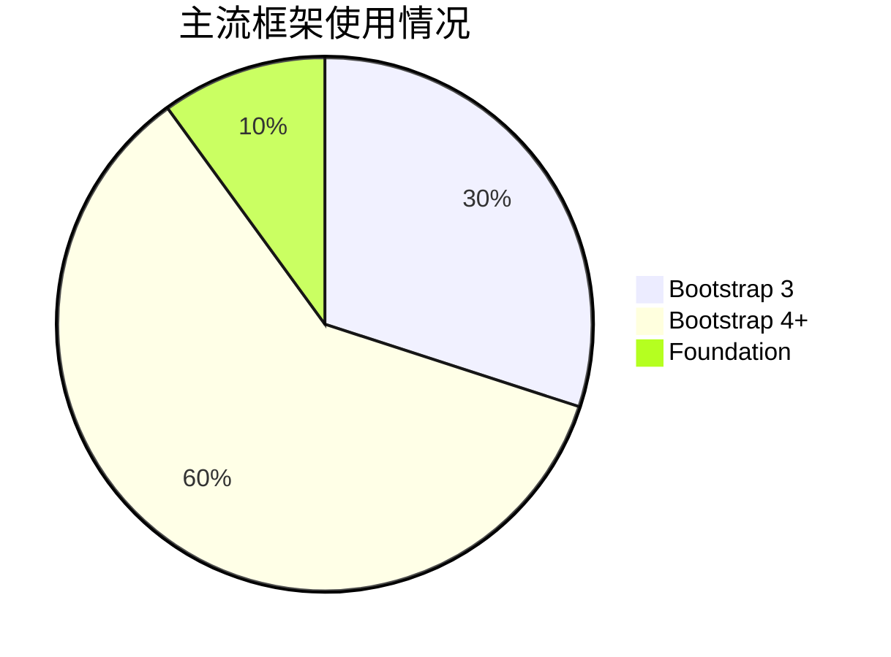

# Sass 与 Less 的对比分析

## 1. 基础定义与历史背景



- **Sass** (Syntactically Awesome Style Sheets):
  - 最初采用 Ruby 实现，现主要使用 Dart 实现的 Dart Sass
  - 支持两种语法格式：
    - `.scss` 文件扩展名（兼容 CSS 语法）
    - `.sass` 文件扩展名（缩进式语法）

- **Less** (Leaner Style Sheets):
  - 基于 JavaScript 开发（Node.js 环境运行）
  - 仅支持类 CSS 的语法格式（`.less` 文件扩展名）

## 2. 核心功能对比

### 2.1 变量系统

```scss
// Sass 变量定义
$primary-color: #3498db;
$base-font-size: 16px;

.container {
    color: $primary-color;
    font-size: $base-font-size * 1.2;
}
```

```less
// Less 变量定义
@primary-color: #3498db;
@base-font-size: 16px;

.container {
    color: @primary-color;
    font-size: @base-font-size * 1.2;
}
```

关键差异：

- Sass 使用 `$` 符号声明变量
- Less 使用 `@` 符号声明变量
- 作用域表现不同：
  - Sass 采用块级作用域
  - Less 支持延迟绑定（类似 JavaScript 变量提升）

### 2.2 嵌套规则

```scss
// Sass 嵌套
.nav {
    ul {
        margin: 0;
        li { 
            padding: 5px;
            &::before { content: ">" }
        }
    }
}
```

```less
// Less 嵌套
.nav {
    ul {
        margin: 0;
        li { 
            padding: 5px;
            &::before { content: ">" }
        }
    }
}
```

共同特性：

- 均支持选择器嵌套
- 支持父选择器引用符 `&`
- 支持属性嵌套（如 `font: { size: 16px; }`）

### 2.3 混入(Mixins)机制

- 用于定义可重用的样式片段
- 可以传递参数和默认值
- 可以包含条件判断和循环控制

```scss
// Sass mixin
@mixin border-radius($radius: 5px) {
    -webkit-border-radius: $radius;
    -moz-border-radius: $radius;
    border-radius: $radius;
}

.button {
    @include border-radius(10px);
}
```

```less
// Less mixin
.border-radius(@radius: 5px) {
    -webkit-border-radius: @radius;
    -moz-border-radius: @radius;
    border-radius: @radius;
}

.button {
    .border-radius(10px);
}
```

差异分析：

| 特性                | Sass                          | Less                   |
|---------------------|-------------------------------|------------------------|
| 参数支持            | 默认值、关键字参数、剩余参数   | 简单参数传递          |
| 条件判断            | 支持 `@if` `@else`            | 依赖 when 条件判断     |
| 循环控制            | `@for` `@each` `@while`       | 递归实现循环          |

### 2.4 继承机制

```scss
// Sass 继承
%message-shared {
    border: 1px solid #ccc;
    padding: 10px;
}

.success {
    @extend %message-shared;
    border-color: green;
}
```

```less
// Less 继承
.message-shared {
    border: 1px solid #ccc;
    padding: 10px;
}

.success {
    &:extend(.message-shared);
    border-color: green;
}
```

编译结果差异：

- Sass 生成合并的选择器组：

```css
.success, .message-shared { ... }
```

- Less 保持原有结构：

```css
.message-shared { ... }
.success { ... }
```

## 3. 高级功能对比

### 3.1 函数系统

```scss
// Sass 颜色函数
$base-color: #3498db;
.element {
    background: darken($base-color, 15%);
    border: 1px solid transparentize($base-color, 0.5);
}
```

```less
// Less 颜色函数
@base-color: #3498db;
.element {
    background: darken(@base-color, 15%);
    border: 1px solid fade(@base-color, 50%);
}
```

函数库对比：

- Sass 提供 200+ 内置函数
- Less 提供 80+ 内置函数
- 数学函数差异：
  - Sass 支持 `random()` `floor()` `ceil()`
  - Less 使用 JavaScript 表达式 `color: rgba(0,0,0, @opacity)`

### 3.2 模块化系统

```scss
// Sass 模块化
// _variables.scss
$primary: #3498db;

// main.scss
@use 'variables' as v;

.header {
    color: v.$primary;
}
```

```less
// Less 导入
// variables.less
@primary: #3498db;

// main.less
@import 'variables';

.header {
    color: @primary;
}
```

关键差异：

- Sass 的 `@use` 实现命名空间隔离
- Less 的 `@import` 会导致全局变量污染
- Sass 支持 `@forward` 转发模块接口

## 4. 生态系统与工具链

### 4.1 编译工具

```text
# Sass 编译命令
npm install -g sass
sass input.scss output.css

# Less 编译命令
npm install -g less
lessc input.less output.css
```

构建工具集成：

- Webpack:
  - Sass: `sass-loader`
  - Less: `less-loader`
- Gulp:
  - Sass: `gulp-sass`
  - Less: `gulp-less`

### 4.2 框架支持



历史演变：

- Bootstrap 3 使用 Less
- Bootstrap 4+ 改用 Sass
- Foundation 框架基于 Sass 构建
