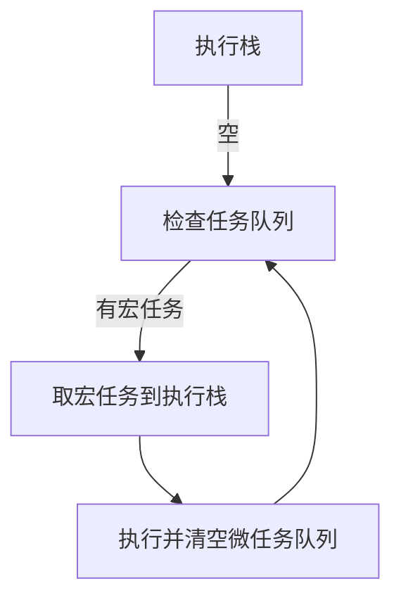
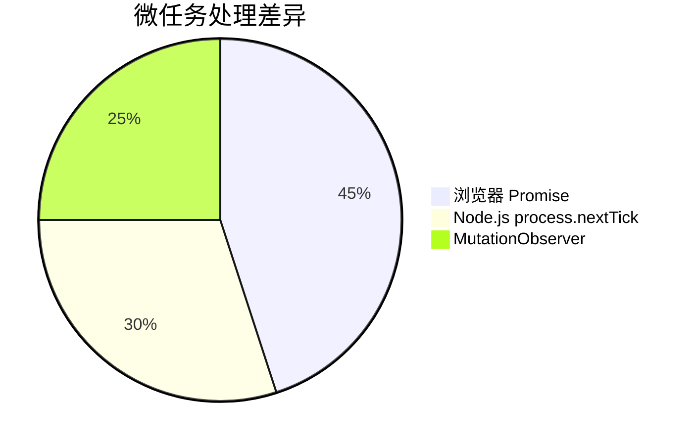

# JavaScript 中的宏任务与微任务详解

[[toc]]

## 1. 事件循环机制基础

JavaScript 是单线程语言，依靠**事件循环 (Event Loop)** 处理异步操作。其核心逻辑是：



## 2. 宏任务 (Macrotask)

### 2.1 定义与特征

- 每个宏任务会创建独立的执行上下文
- 浏览器渲染流程会在宏任务之间执行
- 常见类型：
  - `setTimeout`/`setInterval`
  - I/O 操作（文件读取、网络请求）
  - DOM 事件回调
  - `requestAnimationFrame`（浏览器环境）
  - `setImmediate`（Node.js 环境）

### 2.2 执行特点

```javascript
console.log('Start');

setTimeout(() => {
  console.log('Timeout 1');
}, 0);

setTimeout(() => {
  console.log('Timeout 2');
}, 0);

console.log('End');

// 输出顺序：
// Start → End → Timeout 1 → Timeout 2
```

## 3. 微任务 (Microtask)

### 3.1 定义与特征

- 在当前宏任务结束后立即执行
- 会阻塞后续宏任务的执行直到队列清空
- 常见类型：
  - `Promise.then`/`catch`/`finally`
  - `process.nextTick`（Node.js）
  - `MutationObserver`

### 3.2 执行特点

```javascript
console.log('Start');

Promise.resolve().then(() => {
  console.log('Promise 1');
});

Promise.resolve().then(() => {
  console.log('Promise 2');
});

console.log('End');

// 输出顺序：
// Start → End → Promise 1 → Promise 2
```

## 4. 混合执行场景分析

### 4.1 复杂执行顺序

```javascript
console.log('Script start');

setTimeout(() => {
  console.log('setTimeout');
}, 0);

Promise.resolve()
  .then(() => {
    console.log('Promise 1');
  })
  .then(() => {
    console.log('Promise 2');
  });

console.log('Script end');

/* 执行顺序：
1. Script start
2. Script end
3. Promise 1
4. Promise 2
5. setTimeout
*/
```

### 4.2 嵌套任务场景

```javascript
console.log('Start');

setTimeout(() => {
  console.log('Timeout 1');
  Promise.resolve().then(() => {
    console.log('Promise in Timeout');
  });
}, 0);

Promise.resolve()
  .then(() => {
    console.log('Promise 1');
    setTimeout(() => {
      console.log('Timeout in Promise');
    }, 0);
  })
  .then(() => {
    console.log('Promise 2');
  });

console.log('End');

/* 执行顺序：
1. Start
2. End
3. Promise 1
4. Promise 2
5. Timeout 1
6. Promise in Timeout
7. Timeout in Promise
*/
```

## 5. 应用场景对比

| 特征            | 宏任务                  | 微任务                  |
|----------------|-----------------------|-----------------------|
| 执行时机          | 事件循环每次迭代           | 当前宏任务结束后立即执行       |
| 优先级           | 低                    | 高                    |
| 适用场景          | 延迟操作、批量处理          | 立即处理、状态更新          |
| 对渲染的影响        | 可能延迟渲染              | 在渲染前执行              |
| 内存占用          | 单个任务独立上下文          | 共享当前执行上下文          |

## 6. 性能注意事项

- 微任务队列过度填充会导致**任务饥饿**：
  ```javascript
  function microtaskLoop() {
    Promise.resolve().then(microtaskLoop);
  }
  microtaskLoop(); // 将阻塞后续所有宏任务执行
  ```
- 推荐使用 `queueMicrotask()` API 代替直接操作：
  ```javascript
  queueMicrotask(() => {
    console.log('Safe microtask');
  });
  ```

## 7. 浏览器与 Node.js 差异



在 Node.js 环境中：

- `process.nextTick` 队列优先级高于 Promise
- `setImmediate` 与 `setTimeout` 的执行顺序取决于上下文

理解宏任务与微任务的执行机制，对于优化异步代码性能、避免执行顺序导致的逻辑错误具有重要意义。在实际开发中，建议通过 Chrome DevTools 的 Performance 面板或 Node.js 的 `--trace-event-categories` 参数进行任务分析。
