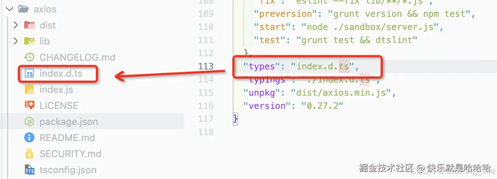

# 类型声明文件.d.ts

为什么需要 .d.ts 文件？
如果我们在ts项目中使用第三方库时，如果这个库内置类型声明文件.d.ts，我们在写代码时可以获得对应的代码补全、接口提示等功能。
比如，我们在index.ts中使用aixos时：
当我们引入axios时，ts会检索aixos的package.json文件，并通过其types属性查找类型声明文件，查找到index.d.ts这个文件后，就会根据其内部配置进行语法提示。



```typescript
import axios from 'axios';
axios.get('http://www.baidu.com').then(res => {
  console.log(res.data);
})
```

但是如果某个库没有内置类型声明文件时，我们使用这个库，不会获得Ts的语法提示，甚至会有类型报错警告

像这种没有内置类型声明文件的，我们就可以自己创建一个xx.d.ts的文件来自己声明，ts会自动读取到这个文件里面的内容的。比如，我们在index.ts中使用"vue-drag"，会提示缺少声明文件。

由于这个库没有@types/xxxx声明包，因此，我们可以在项目内自定义一个vueDrag.d.ts声明文件。

```typescript
// vueDrag.d.ts
 
declare module 'vue-drag'

```

这个时候，就不会报错了,没什么警告了。

## 第三方库的默认类型声明文件

当我们引入第三方库时，ts会自动检索aixos的package.json文件，并通过其types属性查找类型声明文件，查找到index.d.ts这个文件后，就会根据其内部配置进行语法提示。比如，我们刚才说的axios

\

- "typings"与"types"具有相同的意义，也可以使用它。
- 主声明文件名是index.d.ts并且位置在包的根目录里（与index.js并列），你就不需要使用"types"属性指定了。
  
## 第三方库的@types/xxxx类型声明文件

如express这类框架，它们的开发时Ts还没有流行，自然没有使用Ts进行开发，也自然不会有ts的类型声明文件。如果你想引入它们时也获得Ts的语法提示，就需要引入它们对应的声明文件npm包了。

使用声明文件包，不用重构原来的代码就可以在引入这些库时获得Ts的语法提示

比如，我们安装express对应的声明文件包后，就可以获得相应的语法提示了。

## .d.ts声明文件

通过上述的几个示例，我们可以知道.d.ts文件的作用和@types/xxxx包一致，@type/xxx需要下载使用，而.d.ts是我们自己创建在项目内的。

.d.ts文件除了可以声明模块，也可以用来声明变量。

例如，我们有一个简单的 JavaScript 函数，用于计算两个数字的总和：

```typescript
// math.js
const sum = (a, b) => a + b export { sum }
```

TypeScript 没有关于函数的任何信息，包括名称、参数类型。为了在 TypeScript 文件中使用该函数，我们在 d.ts 文件中提供其定义：

```typescript
// math.d.ts
declare function sum(a: number, b: number): number export { sum }
```

现在，我们可以在 TypeScript 中使用该函数，而不会出现任何编译错误。

.ts 是标准的 TypeScript 文件。其内容将被编译为 JavaScript。

*.d.ts 是允许在 TypeScript 中使用现有 JavaScript 代码的类型定义文件，其不会编译为 JavaScript。

## shims-vue.d.ts

shims-vue.d.ts 文件的主要作用是声明 Vue 文件的模块类型，使得 TypeScript 能够正确地处理 .vue 文件，并且不再报错。通常这个文件会放在项目的根目录或 src 目录中。

shims-vue.d.ts 文件的内容一般长这样：

```typescript
// shims-vue.d.ts
 
declare module '*.vue' {
 
    import { DefineComponent } from 'vue';
    
    const component: DefineComponent<{}, {}, any>;
 
    export default component;
 
}
```

- declare module '*.vue' : 这行代码声明了一个模块，匹配所有以 .vue 结尾的文件。* 是通配符，表示任意文件名。
- import { DefineComponent } from 'vue'; : 引入 Vue 的 DefineComponent 类型。这是 Vue 3 中定义组件的类型，它具有良好的类型推断和检查功能。
- const component: DefineComponent<{}, {}, any>; : 定义一个常量 component，它的类型是 DefineComponent，并且泛型参数设置为 {} 表示没有 props 和 methods 的基本 Vue 组件类型。any 用来宽泛地表示组件的任意状态。
- export default component; : 将这个组件类型默认导出。这样，当你在 TypeScript 文件中导入 .vue 文件时，TypeScript 就知道导入的内容是一个 Vue 组件。

## declare

.d.ts 文件中的顶级声明必须以 “declare” 或 “export” 修饰符开头。

通过declare声明的类型或者变量或者模块，在include包含的文件范围内，都可以直接引用而不用去import或者import type相应的变量或者类型。

- declare声明一个类型

```typescript
declare type Asd { name: string; }
```

- declare声明一个模块
  
```typescript
declare module 'vue-drag'
```

.d.ts文件顶级声明declare最好不要跟export同级使用，不然在其他ts引用这个.d.ts的内容的时候，就需要手动import导入了

在.d.ts文件里如果顶级声明不用export的话，declare和直接写type、interface效果是一样的，在其他地方都可以直接引用

```typescript
declare type Ass = { 
    a: string; 
} 
 
type Bss = { 
    b: string; 
};
```

## namespace 声明、理解和使用

### TS的namespace

TS的namespace，通过字面意思命名空间，我们可以扩充含义为： 有命名的一个空间？ 用来命名的空间？... 无论如何理解，我们可以推导出ts给我们提供的该关键字，主要是让我们的编码提供一个空间的概念。
简而言之：namespace给我们提供了更优秀的编码规范能力。

### namespace的使用

声明namespace到一个声明文件中例如（typing.d.ts），在声明文件中声明，这样就不需要import就可以使用该命名空间了。

```typescript

//该文件 ： typing.d.ts 
// 声明 命名空间 这个空间的命名，我以鞋柜举例
declare namespace SHOEBOX {
    
    //在这里吗我们可以进行该空间下的方法、类型、接口、实体类等等定义
    //就像定义鞋子在鞋柜意思一样。
    type Shoe = {
        size:number
        name:string
    }
}

```

使用namespace,无需import通过命名空间调用即可。

```typescript
//other.ts 其他的ts文件中
const shoe:SHOEBOX.Shoe = {
    size:1,
    name:"帆布鞋",
}
```

如果文件中有大量该namespace中的声明类型，不想在前面加命名空间怎么办？

如：我想把 SHOEBOX.Shoe变成 Shoe。 我在实际项目中看见有的同事项目中大量的调用，代码看着难受。所以想着命名空间是不是在需要大量引用的时候可以import，省去后面的调用操作？ 答案是：可以的！
在React的声明文件中，我们可以看到React本身也是一个命名空间，那我们为什么可以import他的声明类型呢？答案就在`export = React; export as namespace React;`这俩行。

所以通过该方法可以导出我们的namespace，从而在其他地方直接导入。 所以我们将文件改成：

```typescript
export = SHOEBOX;   
export as namespace SHOEBOX;
//该文件 ： typing.d.ts 
declare namespace SHOEBOX {
    //export 该类型
   export type Shoe = {
        size:number
        name:string
    }
}

```

在需要的大量调用的文件中，我们就可以import了！

```typescript
import {Shoe} from './typing'

const shoe:Shoe = {
    size:1,
    name:"鞋子"
}
```
