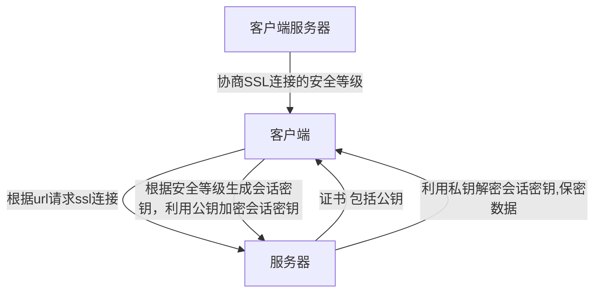

# Http 和 Https

## HTTP

HTTP (HyperText Transfer Protocol)，即超文本运输协议，是实现网络通信的一种规范

在计算机和网络世界有，存在不同的协议，如广播协议、寻址协议、路由协议等等......

而HTTP是一个传输协议，即将数据由A传到B或将B传输到A，并且 A 与 B 之间能够存放很多第三方，如： A<=>X<=>Y<=>Z<=>B

传输的数据并不是计算机底层中的二进制包，而是完整的、有意义的数据，如HTML 文件, 图片文件, 查询结果等超文本，能够被上层应用识别

在实际应用中，HTTP常被用于在Web浏览器和网站服务器之间传递信息，以明文方式发送内容，不提供任何方式的数据加密

特点如下：

- 支持客户/服务器模式

- 简单快速：客户向服务器请求服务时，只需传送请求方法和路径。由于HTTP协议简单，使得HTTP服务器的程序规模小，因而通信速度很快

- 灵活：HTTP允许传输任意类型的数据对象。正在传输的类型由 `Content-Type` 加以标记

- 无连接：无连接的含义是限制每次连接只处理一个请求。服务器处理完客户的请求，并收到客户的应答后，即断开连接。采用这种方式可以节省传输时间

- 无状态：HTTP协议无法根据之前的状态进行本次的请求处理

## HTTPS

在上述介绍HTTP中，了解到HTTP传递信息是以明文的形式发送内容，这并不安全。而HTTPS出现正是为了解决HTTP不安全的特性

为了保证这些隐私数据能加密传输，让HTTP运行安全的SSL/TLS协议上，即 `HTTPS = HTTP + SSL/TLS`，通过 `SSL` 证书来验证服务器的身份，并为浏览器和服务器之间的通信进行加密

`SSL` 协议位于 `TCP/IP` 协议与各种应用层协议之间，浏览器和服务器在使用 `SSL` 建立连接时需要选择一组恰当的加密算法来实现安全通信，为数据通讯提供安全支持

流程图如下所示：

- 首先客户端通过URL访问服务器建立SSL连接
- 服务端收到客户端请求后，会将网站支持的证书信息（证书中包含公钥）传送一份给客户端
- 客户端的服务器开始协商SSL连接的安全等级，也就是信息加密的等级
- 客户端的浏览器根据双方同意的安全等级，建立会话密钥，然后利用网站的公钥将会话密钥加密，并传送给网站
- 服务器利用自己的私钥解密出会话密钥
- 服务器利用会话密钥加密与客户端之间的通信

## 的区别

- HTTPS是HTTP协议的安全版本，HTTP协议的数据传输是明文的，是不安全的，HTTPS使用了SSL/TLS协议进行了加密处理，相对更安全
- HTTP 和 HTTPS 使用连接方式不同，默认端口也不一样，HTTP是80，HTTPS是443
- HTTP 页面响应速度比 HTTPS 快，主要是因为 `HTTP` 使用 `TCP` 三次握手建立连接，客户端和服务器需要交换 `3` 个包，而 `HTTPS` 除了 `TCP` 的三个包，还要加上 `ssl` 握手需要的 `9` 个包，所以一共是 `12` 个包。
- HTTPS需要SSL，SSL 证书需要钱，功能越强大的证书费用越高
- HTTPS 其实就是建构在 `SSL/TLS` 之上的 `HTTP` 协议，所以，要比较 `HTTPS` 比 `HTTP` 要更耗费服务器资源。
  