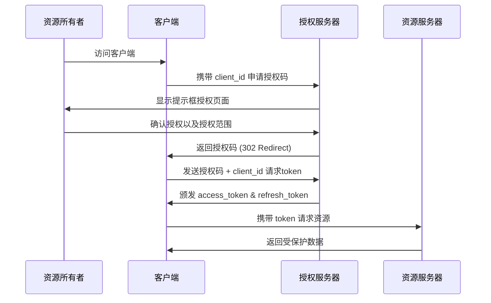
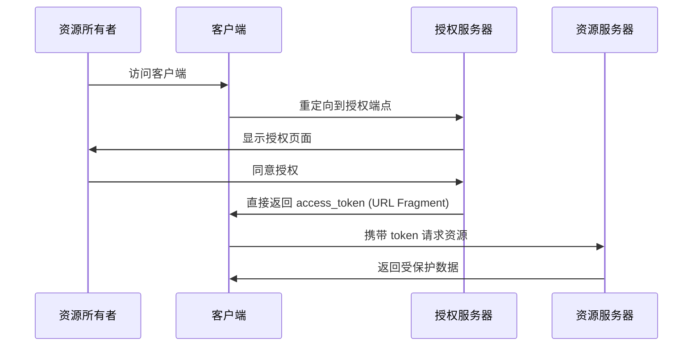
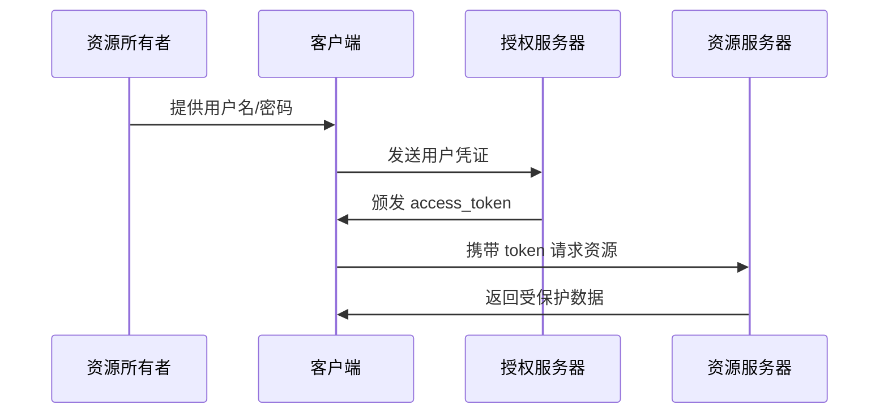
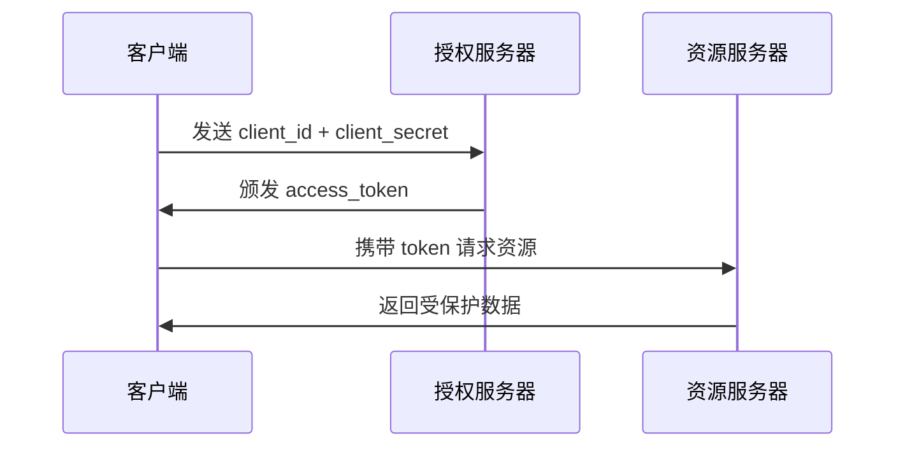

# OAuth2 核心概念与授权方式详解

## 一、OAuth2 基本概念

OAuth2 是一种**授权框架**，允许第三方应用在用户授权后有限访问其资源，包含四个核心角色：

1. **资源所有者 (Resource Owner)**：数据拥有者（终端用户）
2. **客户端 (Client)**：请求访问的第三方应用
3. **授权服务器 (Authorization Server)**：颁发访问令牌
4. **资源服务器 (Resource Server)**：存储受保护资源

## 二、四种授权方式流程图示

### 1. 授权码模式 (Authorization Code)

- 客户端请求获取访问令牌，并向授权服务器提供授权许可（这里有四种认证方式）
- 授权服务器对客户端身份进行认证，并校验授权许可，如果校验通过，则发放访问令牌和刷新令牌
- 客户端通过访问令牌（Access Token）访问受保护的资源
- 资源服务器校验访问令牌（Access Token），如果校验通过，则提供服务，返回资源
- 重复（3）和（4）直到访问令牌过期。如果客户端访问令牌（Access Token）已经过期，则认证服务器会返回InvalidTokenError异常（6），此时不能继续访问受保护的资源
- 当访问令牌（Access Token）失效以后，资源服务器返回一个无效令牌错误
- 客户端通过刷新令牌（Refresh Token）请求获取一个新的访问令牌
- 授权服务器对客户端进行身份认证并校验刷新令牌，如果校验通过，则发放新的访问令牌（并且，可以选择发放新的刷新令牌）

---

### 2. 隐式授权模式 (Implicit)

**核心特点**：

- 相比授权码方式，省去了授权码交换步骤
- 令牌直接通过前端传递
- 适用于纯前端应用（SPA）
- 不支持刷新令牌
- 存在令牌泄露风险

---

### 3. 密码模式 (Resource Owner Password Credentials)

**核心特点**：

- 直接传递用户凭证
- 仅适用于高度信任的客户端
- 不支持第三方应用
- 违反「密码不离开用户设备」原则

---

### 4. 客户端凭证模式 (Client Credentials)

**核心特点**：

- 客户端代表自己而非用户
- 适用于机器到机器通信,只适用于应用是受信任的场景
- 无用户参与流程
- 访问范围限于客户端自身资源

---

## 三、流程对比与选型指南

### 安全特性对比矩阵

| 授权方式         | 用户参与 | 前端暴露令牌 | 支持刷新令牌 | 适用场景                |
|------------------|----------|--------------|--------------|-------------------------|
| 授权码模式       | ✅        | ❌            | ✅            | Web 应用/移动应用       |
| 隐式模式         | ✅        | ✅            | ❌            | SPA 单页应用            |
| 密码模式         | ✅        | ❌            | ✅            | 内部可信应用            |
| 客户端凭证模式   | ❌        | ❌            | ✅            | 服务间通信              |
