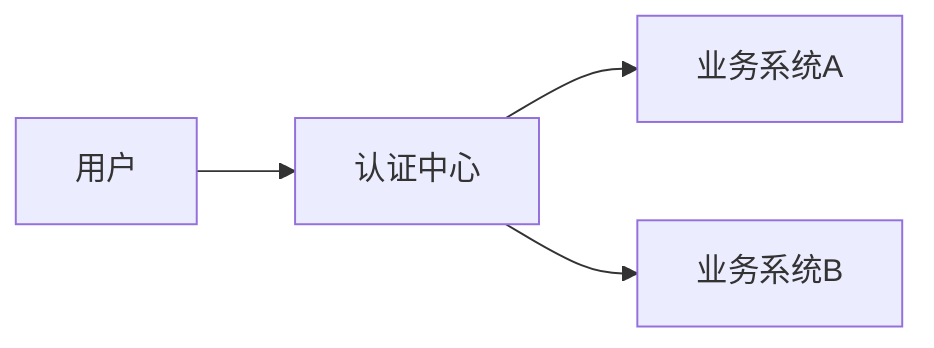
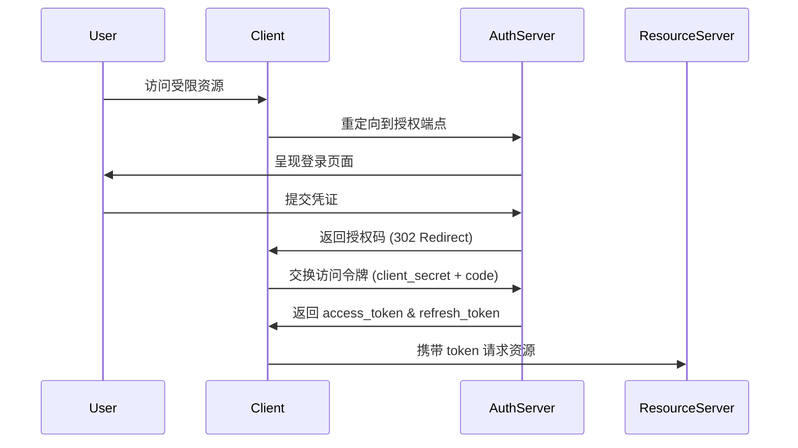
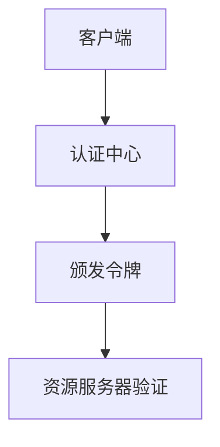

# SSO 实现指南

[[toc]]

## 1. SSO 核心原理

### 1.1 基本概念

单点登录 (Single Sign-On) 是一种身份验证方案，允许用户通过一次登录访问多个互信系统。典型实现包含三个核心组件：



### 1.2 认证流程（OAuth2 授权码模式）



## 2. 前端实现关键步骤

### 2.1 令牌管理策略

```javascript
// 安全存储方案示例
const safeStorage = {
  setToken: (token) => {
    localStorage.setItem('access_token', token)
    document.cookie = `refresh_token=${token}; Path=/; Secure; SameSite=Strict`
  },
  getAccessToken: () => {
    return localStorage.getItem('access_token')
  }
}

// Axios 请求拦截器
axios.interceptors.request.use(config => {
  config.headers.Authorization = `Bearer ${safeStorage.getAccessToken()}`
  return config
})
```

### 2.2 跨域解决方案

```text
Access-Control-Allow-Origin: https://sso.example.com
Access-Control-Allow-Credentials: true
Access-Control-Expose-Headers: Authorization
```

## 3. 主流实现方案对比

### 3.1 常见 SSO 协议

| 协议类型       | 适用场景                  | 前端交互特点              |
|---------------|-------------------------|-------------------------|
| OAuth2        | 第三方授权                | 需要处理重定向和 code 交换   |
| OpenID Connect | 标准化身份认证             | 使用 JWT 格式的 ID Token  |
| SAML 2.0      | 企业级集成                | 依赖 XML 和 POST 绑定     |
| JWT           | 轻量级认证                | 自包含令牌，无需会话存储      |

### 3.2 典型架构模式

#### 3.2.1 中央认证模式



#### 3.2.2 跨域令牌共享

```javascript
// 主应用域 example.com
window.postMessage({
  type: 'SSO_TOKEN',
  token: 'eyJhbGciOi...'
}, 'https://sub.example.com')

// 子应用域 sub.example.com
window.addEventListener('message', (event) => {
  if (event.origin === 'https://example.com') {
    localStorage.setItem('access_token', event.data.token)
  }
})
```

## 4. 安全实践要点

### 4.1 防御策略矩阵

| 攻击类型 | 防御措施                                                                 |
|---------|--------------------------------------------------------------------------|
| XSS      | 严格 CSP 策略、JWT 签名验证、HttpOnly Cookie                             |
| CSRF     | SameSite Cookie、State 参数校验、Anti-CSRF Token                        |
| 重放攻击  | JWT jti 校验、timestamp 验证                                           |
| 令牌泄露  | 短期 token 有效期、HTTPS 强制、令牌绑定客户端指纹                        |

### 4.2 令牌刷新机制

```javascript
// 自动刷新令牌逻辑
const refreshToken = async () => {
  try {
    const response = await axios.post('/auth/refresh', {
      refresh_token: getRefreshToken()
    })
    storeNewTokens(response.data)
    return true
  } catch (error) {
    logout()
    return false
  }
}

// 响应拦截器处理 401
axios.interceptors.response.use(null, async (error) => {
  if (error.response.status === 401) {
    const refreshed = await refreshToken()
    if (refreshed) return axios(error.config)
  }
  return Promise.reject(error)
})
```

## 5. 现代框架集成方案

### 5.1 React 实现示例

```jsx
// SSO 上下文提供者
const AuthContext = createContext()

export const AuthProvider = ({ children }) => {
  const [user, setUser] = useState(null)

  const login = async () => {
    const token = await auth0.getAccessTokenSilently()
    const profile = await auth0.getUser()
    setUser(profile)
  }

  return (
    <AuthContext.Provider value={{ user, login }}>
      {children}
    </AuthContext.Provider>
  )
}
```

### 5.2 Vue 路由守卫

```javascript
// 全局前置守卫
router.beforeEach(async (to, from, next) => {
  if (to.meta.requiresAuth) {
    if (!store.getters.isAuthenticated) {
      try {
        await store.dispatch('ssoLogin')
        next()
      } catch (error) {
        next('/login')
      }
    } else {
      next()
    }
  } else {
    next()
  }
})
```

## 6. 性能优化策略

### 6.1 令牌验证缓存

```javascript
const tokenCache = new Map()

const verifyToken = async (token) => {
  if (tokenCache.has(token)) {
    return tokenCache.get(token)
  }
  const isValid = await authServer.verify(token)
  tokenCache.set(token, isValid)
  return isValid
}
```

### 6.2 预认证检查

```javascript
// 使用 Web Worker 提前验证
const authWorker = new Worker('./auth.worker.js')

authWorker.postMessage({
  type: 'CHECK_TOKEN',
  token: localStorage.getItem('access_token')
})

authWorker.onmessage = (event) => {
  if (event.data.valid === false) {
    showReLoginModal()
  }
}
```

## 7. 常见问题解决方案

### 7.1 跨域会话保持

```javascript
// 主应用 (sso.example.com)
function setCrossDomainCookie() {
  document.cookie = `sso_token=abc123; Domain=.example.com; Path=/; Secure`
}

// 子应用 (app1.example.com)
function checkSSOCookie() {
  const token = document.cookie.match(/sso_token=([^;]+)/)
  if (token) initSession(token[1])
}
```

### 7.2 多标签页同步

```javascript
// 使用 BroadcastChannel
const authChannel = new BroadcastChannel('auth')

authChannel.onmessage = (event) => {
  if (event.data.type === 'LOGOUT') {
    clearLocalStorage()
    redirectToLogin()
  }
}

// 登出时广播
function logout() {
  authChannel.postMessage({ type: 'LOGOUT' })
}
```

## 8. 监控与调试工具

### 8.1 Chrome 开发者工具

```text
Application > Storage > Cookies - 检查 SSO 相关 Cookie
Network > Filter: /oauth2 - 分析认证请求
```

### 8.2 JWT 调试工具

```javascript
// 解码 JWT 负载
const parseJWT = (token) => {
  try {
    return JSON.parse(atob(token.split('.')[1]))
  } catch (e) {
    return null
  }
}

console.log(parseJWT('eyJhbGci...'))
```
