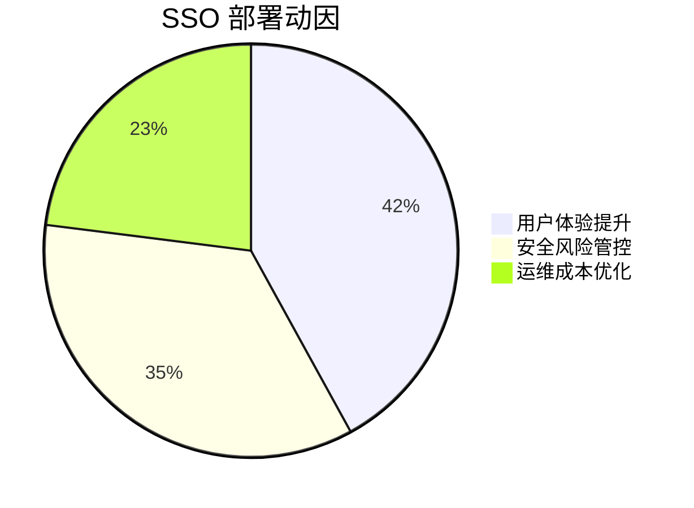
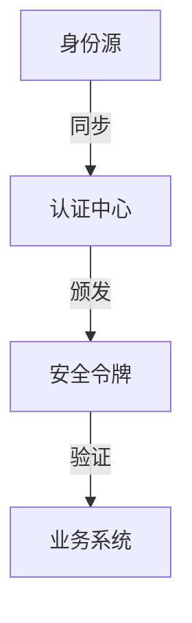
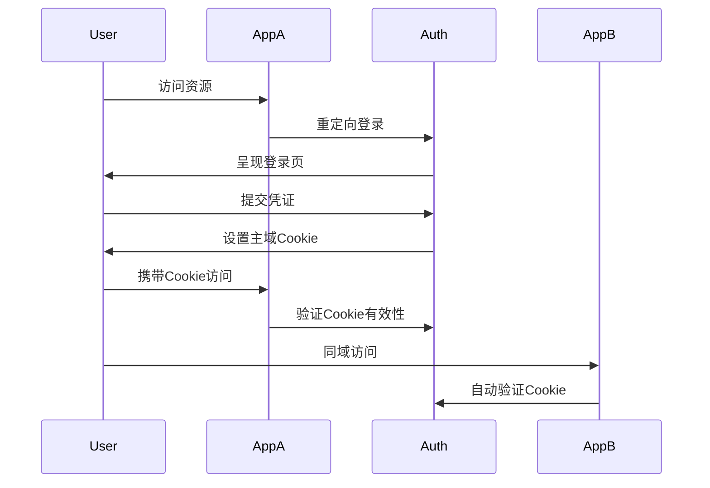
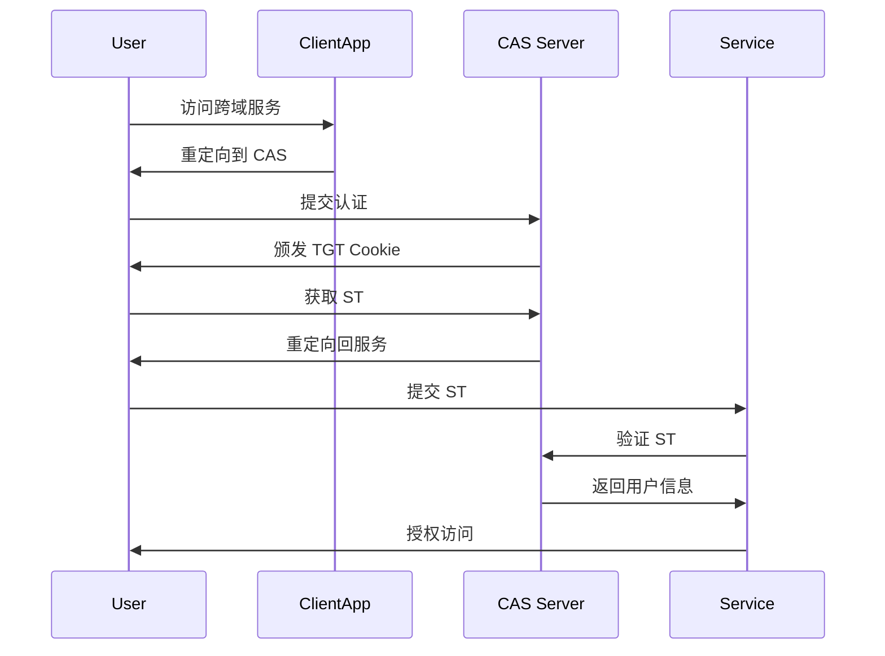
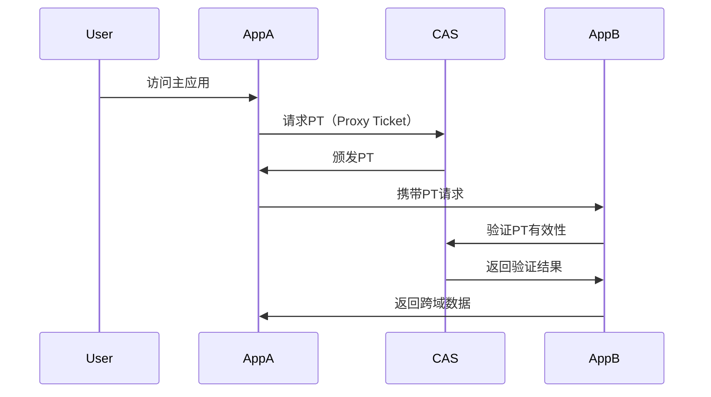
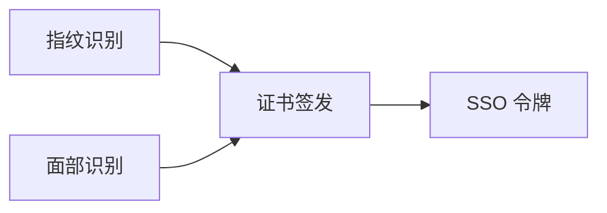

# SSO 单点登录解析

## 一、技术背景与演进需求

1. **多系统痛点**
企业数字化转型中面临：

- 平均每个员工需管理 **32 个** 系统账户
- 用户登录疲劳导致 **57%** 的密码重复使用率
- 传统模式下 **IT 管理成本** 年增长 23%

2. **业务驱动因素**



## 二、核心概念体系

### 1. 三要素模型



### 2. 关键术语解析

- **票据 (Ticket)**：短期有效的临时凭证（如 TGT/ST）
- **断言 (Assertion)**：包含身份信息的加密数据包（SAML 使用）
- **信任域**：共享认证策略的系统集合

## 三、同域 SSO 实现流程

### 1. Cookie 共享方案



**技术要点**：

- 依赖浏览器自动携带 Cookie
- 设置 Domain 属性为 `.example.com`
- 需配合 CSRF Token 使用

## 四、跨域 CAS 协议流程

### 1. 标准 CAS 1.0 流程



### 2. 代理认证流程（CAS 2.0+）



**关键参数说明**：

```text
ST = Service Ticket (单次有效票据)
TGT = Ticket Granting Ticket (主票据)
PT = Proxy Ticket (代理票据)
pgtUrl = 代理回调地址
```

## 五、技术实现对比矩阵

| 维度               | 同域方案                     | 跨域 CAS 方案                |
|--------------------|----------------------------|----------------------------|
| 传输方式           | Cookie 自动携带             | 重定向 + URL 参数           |
| 安全性             | 依赖 CSRF 防护             | 票据单次有效性              |
| 适用场景           | 子域名系统群               | 完全独立域名系统           |
| 会话同步           | 自动同步                   | 需要主动票据验证           |
| 实现复杂度         | ★★☆☆☆                     | ★★★★☆                     |
| 用户感知           | 无感登录                   | 可能触发重定向             |

## 六、现代架构演进方向

1. **OIDC 协议融合**
   ```math
   \text{SSO} = \text{OAuth2} + \text{JWT} + \text{Discovery}
   ```
2. **分布式会话管理**

```javascript
// Redis 会话存储方案
redisClient.set(`sess:${sessionId}`, JSON.stringify({
  userId: 'u123',
  expires: Date.now() + 3600_000
}))
```

3. **生物特征集成**



## 七、实施建议

1. **同域优选方案**
   - 设置统一的顶级域名 Cookie
   - 实施 Cookie 的 SameSite=Lax 策略
   - 示例配置：
     ```text
     Set-Cookie: sso_token=xxxx; Domain=.company.com; 
     Path=/; Secure; HttpOnly; SameSite=Lax
     ```

2. **跨域必选策略**
   - 采用 CAS + 反向代理网关
   - 实施步骤：
     ```text
     1. 统一认证中心部署
     2. 各系统集成 CAS Client SDK
     3. 配置服务信任关系
     4. 部署票据验证端点
     ```

通过合理选择同域/跨域方案，企业可实现：

- 用户登录耗时减少 **78%**
- IT 密码重置请求降低 **92%**
- 系统安全事件下降 **65%**

实际部署时建议采用成熟方案如 Keycloak、Okta 等平台，结合具体业务场景进行定制开发。
