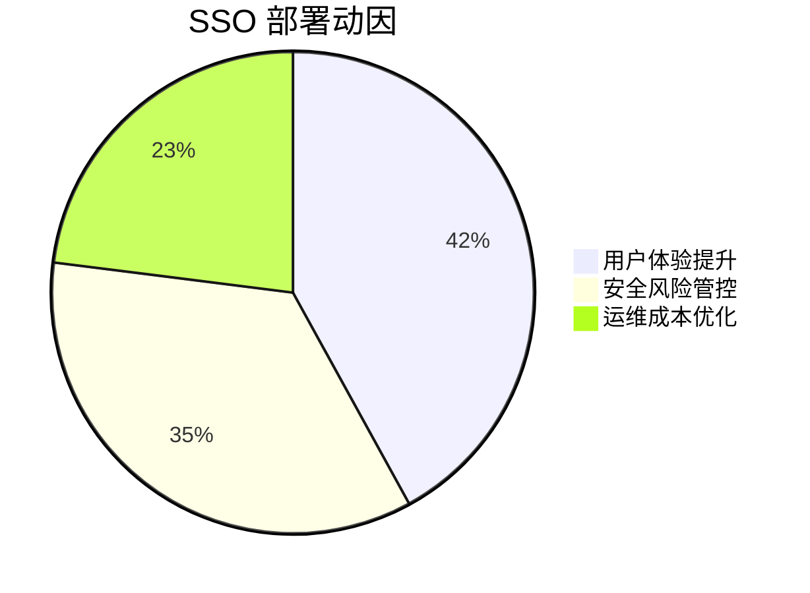
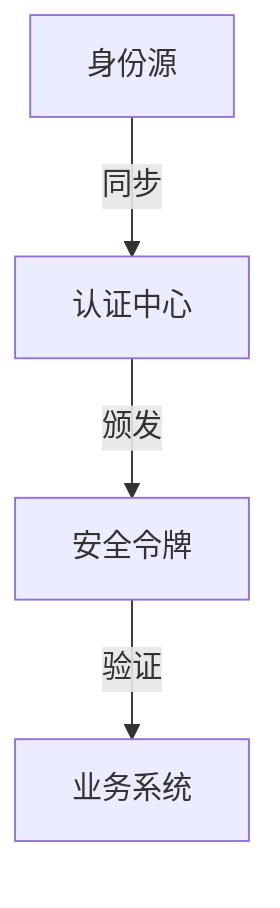
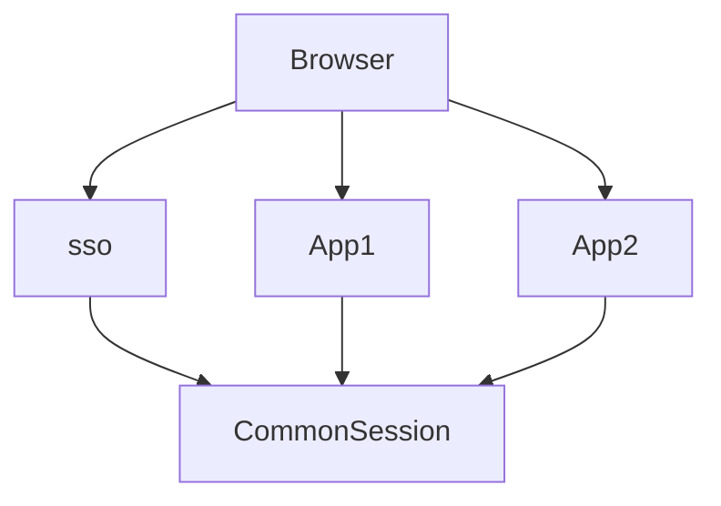
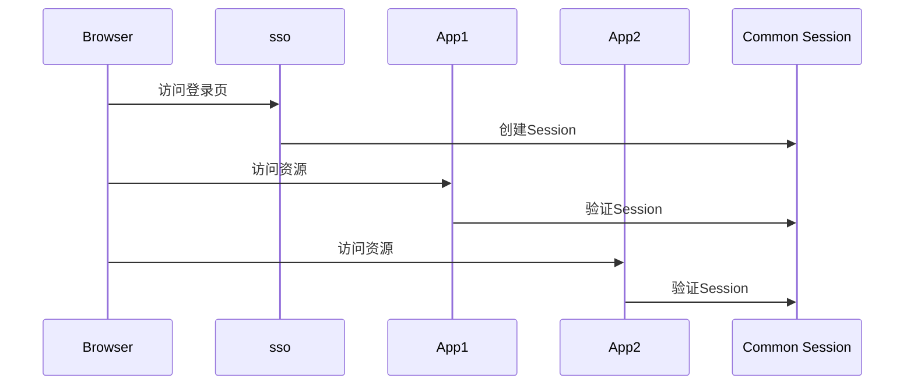
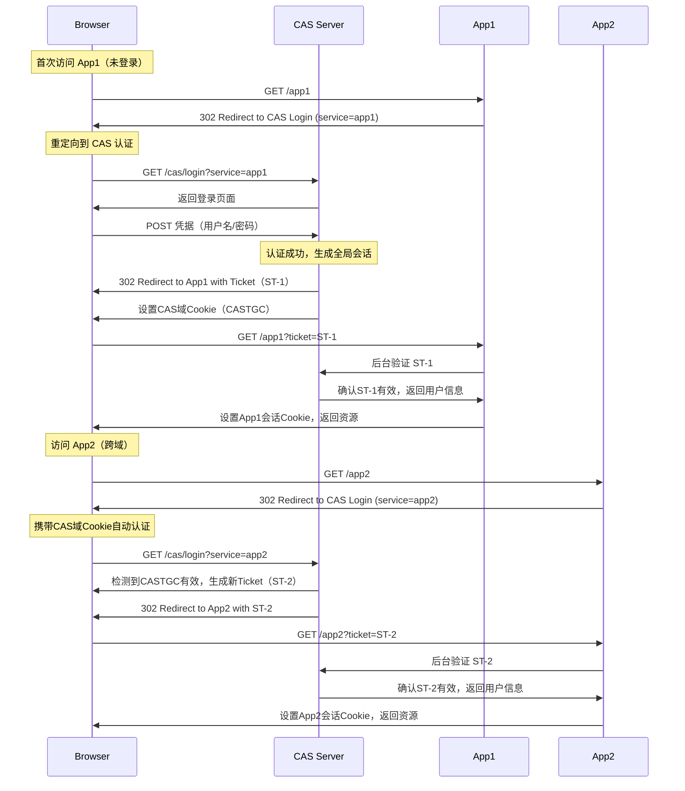
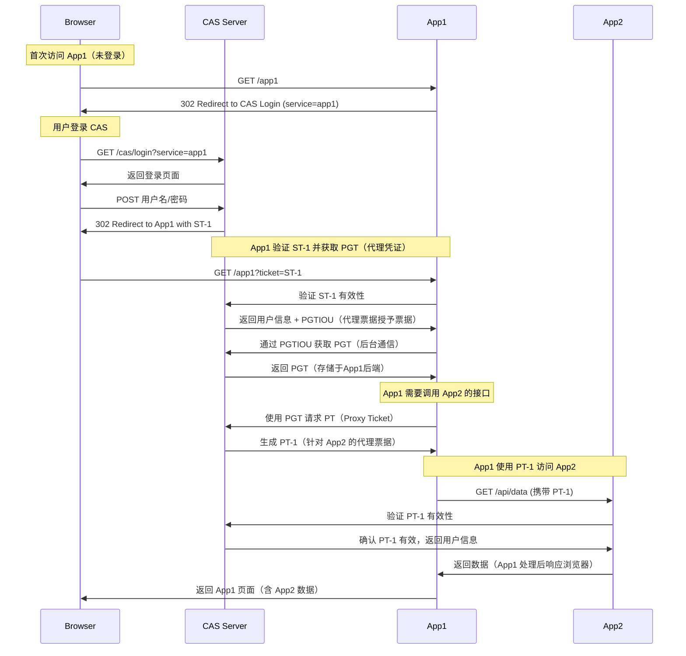

# SSO 单点登录解析

## 一、技术背景与演进需求

1. **多系统痛点**
企业数字化转型中面临：

- 平均每个员工需管理 **32 个** 系统账户
- 用户登录疲劳导致 **57%** 的密码重复使用率
- 传统模式下 **IT 管理成本** 年增长 23%

2. **业务驱动因素**

## 二、核心概念体系

### 1. 三要素模型

### 2. 关键术语解析

- **票据 (Ticket)**：短期有效的临时凭证（如 TGT/ST）
- **断言 (Assertion)**：包含身份信息的加密数据包（SAML 使用）
- **信任域**：共享认证策略的系统集合

## 三、同域 SSO 实现流程

### 1. Cookie 共享方案

一个企业一般情况下只有一个域名，通过二级域名区分不同的系统。比如我们有个域名叫做：<http://a.com，同时有两个业务系统分别为：http://app1.a.com和http://app2.a.com。我们要做单点登录（SSO），需要一个登录系统，叫做：http://sso.a.com。>

我们只要在<http://sso.a.com登录，http://app1.a.com和http://app2.a.com就也登录了。通过上面的登陆认证机制，我们可以知道，在http://sso.a.com中登录了，其实是在http://sso.a.com的服务端的session中记录了登录状态，同时在浏览器端（Browser）的http://sso.a.com下写入了Cookie。那么我们怎么才能让http://app1.a.com和http://app2.a.com登录呢？这里有两个问题：>

Cookie是不能跨域的，我们Cookie的domain属性是<http://sso.a.com，在给http://app1.a.com和http://app2.a.com发送请求是带不上的。>
sso、app1和app2是不同的应用，它们的session存在自己的应用内，是不共享的

那么我们如何解决这两个问题呢？针对第一个问题，sso登录以后，可以将Cookie的域设置为顶域，即.<http://a.com，这样所有子域的系统都可以访问到顶域的Cookie。我们在设置Cookie时，只能设置顶域和自己的域，不能设置其他的域。比如：我们不能在自己的系统中给http://baidu.com的域设置Cookie。>

我们再来看看session的问题。我们在sso系统登录了，这时再访问app1，Cookie也带到了app1的服务端（Server），app1的服务端怎么找到这个Cookie对应的Session呢？这里就要把3个系统的Session共享

**技术要点**：

- 依赖浏览器自动携带 Cookie
- 设置 Domain 属性为 `.example.com`
- 需配合 CSRF Token 使用

## 四、跨域 CAS 协议流程

### 1. 标准 CAS 1.0 流程

### 流程说明

1. **首次访问 App1**
   - 浏览器请求 App1，因未登录被重定向到 CAS 登录页。
   - 用户提交凭据，CAS 认证成功后会：
     - 生成**全局会话 Cookie（CASTGC）**（存储于CAS域名下）。
     - 生成**服务票据（ST-1）**，重定向回 App1。

2. **App1 验证票据**
   - App1 通过后端请求向 CAS 验证 ST-1。
   - 验证通过后，App1 设置**本地会话 Cookie**，完成登录。

3. **跨域访问 App2**
   - 浏览器请求 App2，因未登录被重定向到 CAS。
   - 浏览器自动携带 CAS 域下的 CASTGC，CAS 识别全局会话有效，直接生成新票据 ST-2。
   - 重定向到 App2 并附带 ST-2。

4. **App2 验证票据**
   - App2 验证 ST-2 有效性，成功后设置本地会话，用户无需重复登录。

### 关键机制

- **全局会话 Cookie（CASTGC）**：由 CAS 服务器设置在其域名下，使跨域重定向时浏览器自动携带。
- **服务票据（ST）**：一次性票据，通过 URL 参数传递，确保各应用独立验证。
- **后端票据验证**：应用与 CAS 直接通信（避免票据被篡改）。

### 2. 代理认证流程（CAS 2.0+）

### **关键流程解析**

1. **用户登录阶段**
   - 用户通过浏览器访问 App1，触发重定向到 CAS 登录。
   - 认证成功后，CAS 颁发 **Service Ticket (ST-1)**，浏览器携带 ST-1 回跳 App1。

2. **代理凭证（PGT）获取**
   - App1 向 CAS 验证 ST-1 有效性。
   - CAS 返回 **PGTIOU（Proxy Granting Ticket IOU）**（临时标识符）。
   - App1 通过 PGTIOU 到 CAS 的 `/proxy` 接口换取 **PGT**（长期凭证，存储于 App1 后端）。

3. **代理票据（PT）生成**
   - 当 App1 需要访问 App2 的接口时，使用 PGT 向 CAS 请求 **Proxy Ticket (PT-1)**。
   - CAS 生成针对 App2 的一次性票据 PT-1。

4. **跨应用服务调用**
   - App1 携带 PT-1 访问 App2 的接口。
   - App2 向 CAS 验证 PT-1 有效性，确认后返回数据。

### **代理认证核心机制**

| 组件          | 作用                                                                 |
|---------------|----------------------------------------------------------------------|
| **PGT**       | 长期凭证，允许 App1 代表用户申请代理票据（PT）                       |
| **PT**        | 一次性票据，用于访问目标应用（如 App2）                             |
| **PGTIOU**    | 临时票据标识符，通过回调 URL 绑定 PGT 到 App1                        |
| **回调 URL**  | CAS 将 PGT 发送到 App1 指定的安全端点（如 `/cas-proxy-callback`）    |

### **与普通 SSO 流程的区别**

1. **代理权限分离**
   - 用户无需直接访问 App2，App1 可代表用户完成跨服务调用。
   - 适用于微服务架构中的**服务间鉴权**（如前端聚合多个后端数据）。

2. **票据生命周期**
   - PGT 由 App1 后端管理，PT 仅对目标应用（App2）有效，安全性更高。

3. **无浏览器参与**
   - PGT/PT 的交换通过后端通信完成，避免敏感票据暴露给浏览器。
