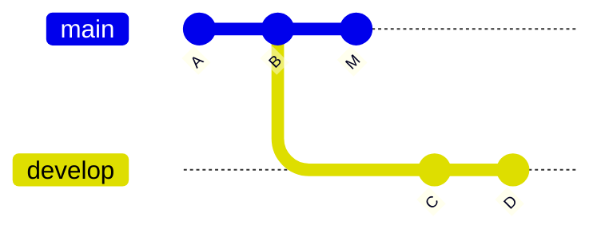

# Git 入门

[[TOC]]

## 1. Git 的起源

Git 是目前世界上最先进的分布式版本控制系统。

Git 的作者是 Linus，即 Linux 的作者。在 Linux 系统不断发展的过程中，Linux 的源码也受到越来越多的关注，并接收来自全世界不同贡献者的提交。管理 Linux 源码是艰难的过程，需要比较各种不同版本的提交，Linux 的作者 Linus 花了两周时间自己用 C 语言写了一个分布式版本控制系统，这就是 Git！用于解决 Linux 源代码管理的问题。

> [!TIP] 为什么使用分布式版本控制系统？
> 集中式版本控制系统（例如 SVN）将代码库存储在一台中央服务器上，团队成员通过客户端从中央服务器获取代码并将更改提交到服务器。这意味着代码库是集中的，所有开发者都在同一个代码库上工作，并且必须与服务器进行通信才能查看历史记录和获取代码。因此，如果服务器发生故障或网络中断，开发者将无法使用代码库。

## 2. Git 安装和配置

Linux 系统可使用包管理器安装：

```bash
# Debian/Ubuntu
sudo apt install git
#  RedHat
sudo yum install git
```

Windows 用户可在 [官网](https://git-scm.com/downloads) 下载安装包，也可以使用 WinGet、Scoop 等包管理器安装：

```bash
winget install Git.Git
```

Git 全局设置：

```bash
git config --global user.name "Your Name"
git config --global user.email "email@example.com"
```

## 3. Git 快速入门

如果你希望零基础快速入门，可以在 [Learn Git Branching](https://learngitbranching.js.org/) 网站上进行练习。



## 4. 创建本地仓库

```bash
mkdir learn-git
cd learn-git
```

初始化仓库：

```bash
git init
```

所有的版本控制系统，只能跟踪文本文件的改动，比如 `.txt` 文件，`.html` 网页，所有的程序代码等等，git 也不例外。版本控制系统可以告诉你每次的改动，比如在第 5 行加了一个单词 `"Linux"`，在第 8 行删了一个单词 `"Windows"`。而图片、视频这些二进制文件，虽然也能由版本控制系统管理，但没法跟踪文件的变化，只能把二进制文件每次改动串起来

在当前目录下面新建 `README.md` 文件，然后写入两行内容：

```txt
Git is a version control system.
Git is free software.
```

使用 `git add` 把文件添加到仓库：

```bash
git add README.md
```

第二步，用命令 `git commit` 告诉 git，把文件提交到仓库：

```bash
git commit -m "add a readme file"
```

简单解释一下 `git commit` 命令，`-m` 后面输入的是本次提交的说明，可以输入任意内容，当然最好是有意义的，这样你就能从历史记录里方便地找到改动记录。

## 5. 版本管理

### 5.1 提交新版本

查看版本状态：

```bash
git status
```

如果需要比较哪些地方被改动了，使用 `git diff` 查看：

```bash
git diff README.md
```

如果我们需要提交被修改后的 `README.md` 文件，需要先添加文件：

```bash
git add README.md
```

我们可以继续查看仓库的状态：

```bash
git status
```

下面我们可以提交修改：

```bash
git commit -m "add distributed"
```

下面，再次查看状态：

```bash
git status
```

显示下面的结果则表示提交成功：

```txt
On branch master
nothing to commit, working tree clean
```

### 5.2 版本回退

使用 `git log` 查看哪些版本被提交到了 git 仓库中：

```bash
git log
```
