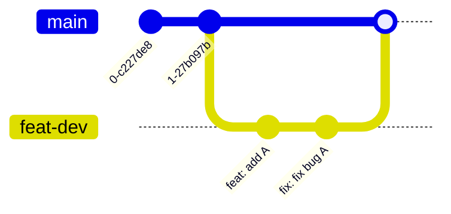

# Git 工作流程

[[TOC]]

## 单分支开发

本文使用简化版 Github Flow 作为示例，介绍 Git 的工作流程。

我们只有一个长期分支 `main`，当需要新功能时，从 `main` 分支创建一个新的分支 `feat-XXX`，然后在 `feat-XXX` 分支上进行开发，开发完成后，将 `feat-XXX` 分支合并到 `main` 分支。

完整的开发流程如下：

1. `git pull`：我们在 `main` 分支上，拉取最新代码，确保本地代码最新
2. `git checkout -b feat-dev`：切换到 `feat-dev` 分支，如果没有此分支，则自动创建
3. 在 `feat-dev` 分支上进行开发
4. `git add .` + `git commit -m "feat: add A"`：提交代码
5. `git push origin feat-dev`：将 `feat-dev` 分支推送到远程仓库
6. `git checkout main`：切换到 `main` 分支
7. `git pull`：拉取最新代码，确保 `main` 分支最新
8. `git merge feat-dev`：将 `feat-dev` 分支合并到 `main` 分支
9. 此时，如果有冲突，需要解决冲突，然后重新提交
10. `git push origin main`：将 `main` 分支推送到远程仓库
11. 如果功能不再开发，可删除 `feat-dev` 分支：`git branch -d feat-dev`，如果需要继续开发，可使用 `git checkout feat-dev` 切换到 `feat-dev` 分支
12. 如果功能继续开发，使用 `git reset --hard origin/main`：确保 `feat-dev` 分支和 `main` 分支一致
13. `git push origin feat-dev`：将 `feat-dev` 分支推送到远程仓库，确保远程仓库和本地仓库一致

如果你在 `main` 分支上没有权限，可从第 5 步开始，通过 Pull Request 的方式合并代码。

Pull Request 提供三种合并代码的方式：

1. Merge：将 `feat-dev` 分支合并到 `main` 分支，保留 `feat-dev` 分支的提交记录
2. Squash and Merge：将 `feat-dev` 分支合并到 `main` 分支，将 `feat-dev` 分支的提交记录合并为一个提交记录
3. Rebase and Merge：将 `feat-dev` 分支合并到 `main` 分支，将 `feat-dev` 分支的提交记录合并到 `main` 分支上

压缩和变基都可能导致提交记录的丢失，所以在合并代码时，我们一般直接使用 Merge 方式。
