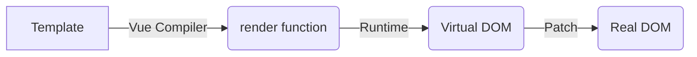
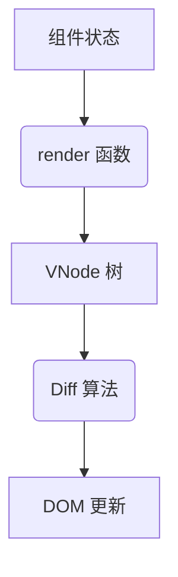
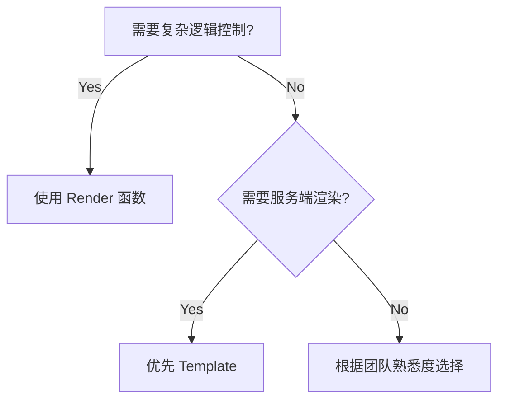

# Vue 3 中 render 函数与 h 函数的深度解析

## 一、Render 函数

### 1. render函数概念

#### 1.1 核心工作机制



手动实现示例：

```typescript
defineComponent({
  render() {
    return h('div', {
      class: ['container', { active: this.isActive }],
      style: { color: this.textColor },
      onClick: this.handleClick
    }, [
      h('span', this.$slots.default()),
      h(ChildComponent, { prop: this.childProp })
    ])
  }
})
```

#### 1.2 动态渲染场景

条件渲染示例：

```typescript
render() {
  if (this.items.length === 0) {
    return h('div', 'No items found')
  }

  return h('ul', 
    this.items.map(item => 
      h('li', { key: item.id }, item.name)
    )
  )
}
```

插槽处理：

```typescript
render() {
  return h(MyLayout, {}, {
    header: () => h('h1', this.title),
    default: () => this.$slots.default(),
    footer: () => h('p', 'Footer content')
  })
}
```

### 2. render 函数的核心作用

#### 2.1 虚拟 DOM 生成引擎



关键作用机制：

- 作为组件的渲染中枢，替代模板编译过程
- 每次响应式数据变更时自动触发执行
- 生成轻量级 VNode 描述树（内存中的 DOM 表示）
- 通过 VNode 对比实现高效 DOM 更新

#### 2.2 与模板渲染的对比

```typescript
// 模板方式
<template>
  <div :class="{ active: isActive }">
    {{ message }}
  </div>
</template>

// Render 函数方式
render() {
  return h('div', {
    class: { active: this.isActive }
  }, this.message)
}
```

优势对比表：

| 特性                | 模板                  | Render 函数          |
|---------------------|-----------------------|----------------------|
| 学习成本            | 低（类 HTML）         | 高（JavaScript）     |
| 灵活性              | 有限（指令系统）      | 完全编程控制         |
| 动态组件            | `<component :is>`     | 直接使用变量         |
| 类型支持            | 有限                  | 完整 TypeScript 支持 |
| 编译时优化          | 有（静态提升）        | 需手动优化           |
| SSR 支持            | 完整                  | 需要额外处理         |

## 二、h 函数

### 1. h 函数基本介绍

#### 1.1 函数签名分析

完整参数结构：

```typescript
function h(
  type: string | Component,
  props?: object | null,
  children?: Children | Slot | Children[]
): VNode
```

参数矩阵说明：

| 参数位置 | 类型                  | 典型值示例                   |
|----------|-----------------------|----------------------------|
| 1        | String                | 'div'                      |
|          | Component Options     | defineComponent({...})     |
|          | Imported Component    | import MyComp from './MyComp' |
| 2        | Object (props/attrs)  | { class: 'btn', onClick: handler } |
|          | Null (占位)           | null                       |
| 3        | String                | 'Click me'                 |
|          | Array (子节点)        | [h('span', 'A'), h('span', 'B')] |
|          | Slot Function         | () => [h('div', 'slot content')] |

#### 1.2 复杂组件创建

动态组件示例：

```typescript
const dynamicComponent = isMobile ? MobileComp : DesktopComp

h(dynamicComponent, {
  modelValue: value,
  'onUpdate:modelValue': (v) => value = v
})
```

事件修饰符模拟：

```typescript
h('input', {
  onKeydown: (e) => {
    if (e.key === 'Enter' && !e.shiftKey) {
      e.preventDefault()
      this.submit()
    }
  }
})
```

#### 1.3 性能优化技巧

避免重复渲染：

```typescript
// 缓存静态节点
const staticNode = h('div', 'Static Content')

render() {
  return h('div', [
    staticNode,
    this.dynamicContent
  ])
}
```

#### 1.4 函数签名深度解析

```typescript
function h(
  type: string | Component,  // 元素/组件类型
  props?: Record<string, any> | null, // 属性/事件对象
  children?: string | Array<VNode> | Slot // 子节点内容
): VNode
```

特殊参数处理示例：

```typescript
// 文本子节点
h('div', null, 'Hello World')

// 嵌套子元素
h('div', { class: 'grid' }, [
  h('div', { class: 'col' }, 'Left'),
  h('div', { class: 'col' }, 'Right')
])

// 混合类型子元素
h('div', [
  'Start',
  h('span', { style: { color: 'red' } }, 'Warning'),
  'End'
])
```

#### 1.5 高级组件模式

动态组件加载：

```typescript
const dynamicComponent = defineAsyncComponent(() => 
  import(`./components/${name}.vue`)
)

render() {
  return h(dynamicComponent, {
    key: this.componentKey // 强制重新挂载
  })
}
```

递归组件实现：

```typescript
const TreeItem = defineComponent({
  name: 'TreeItem',
  props: { depth: { type: Number, default: 0 }},
  setup(props) {
    return () => h('div', [
      h('div', `Level ${props.depth}`),
      props.depth < 3 && h(TreeItem, { depth: props.depth + 1 })
    ])
  }
})
```

### 二、实战应用模式

#### 2.1 动态表格生成器

```typescript
const SmartTable = defineComponent({
  props: {
    columns: Array as PropType<string[]>,
    data: Array as PropType<Record<string, any>[]>
  },
  render() {
    return h('table', { class: 'data-table' }, [
      h('thead', [
        h('tr', this.columns.map(col => 
          h('th', { key: col }, col.toUpperCase())
        ))
      ]),
      h('tbody', this.data?.map(row => 
        h('tr', { key: row.id }, this.columns.map(col =>
          h('td', row[col])
        ))
      ))
    ])
  }
})
```

#### 2.2 高阶组件工厂

```typescript
function withLoading(WrappedComponent: Component) {
  return defineComponent({
    setup(props, { slots }) {
      const loading = ref(false)
    
      return () => [
        h('div', { class: 'loader', vShow: loading.value }),
        h(WrappedComponent, {
          ...props,
          onBeforeRequest: () => loading.value = true,
          onAfterRequest: () => loading.value = false
        })
      ]
    }
  })
}
```

### 三、性能优化策略

#### 3.1 静态节点提升

```typescript
// 低效写法（每次渲染重新创建）
render() {
  return h('div', [
    h('header', 'Site Title'),
    h('main', this.content)
  ])
}

// 优化后（静态节点缓存）
const staticHeader = h('header', 'Site Title')

render() {
  return h('div', [
    staticHeader,
    h('main', this.content)
  ])
}
```

#### 3.2 条件渲染优化

```typescript
// 低效条件判断
render() {
  if (this.mode === 'A') {
    return h(LayoutA, { ... })
  } else {
    return h(LayoutB, { ... })
  }
}

// 优化策略（组件缓存）
const layoutMap = {
  A: h(LayoutA),
  B: h(LayoutB)
}

render() {
  return h('div', [
    layoutMap[this.mode]
  ])
}
```

### 四、与 Composition API 的深度集成

#### 4.1 响应式渲染控制

```typescript
const Counter = defineComponent({
  setup() {
    const count = ref(0)
    const double = computed(() => count.value * 2)

    return () => h('div', [
      h('button', { onClick: () => count.value++ }, '+'),
      h('span', `Count: ${count.value} (${double.value})`)
    ])
  }
})
```

#### 4.2 自定义指令实现

```typescript
const vHighlight = {
  mounted: (el, binding) => {
    el.style.backgroundColor = binding.value
  },
  updated: (el, binding) => {
    el.style.backgroundColor = binding.value
  }
}

render() {
  return h('div', {
    directives: [
      { name: 'highlight', value: this.activeColor }
    ]
  })
}
```

### 五、综合应用模式

#### 5.1 组合式 API 集成

```typescript
import { h, defineComponent, ref } from 'vue'

export default defineComponent({
  setup(props, { slots }) {
    const count = ref(0)

    return () => h('div', [
      h('button', { onClick: () => count.value++ }, 'Increment'),
      h('span', `Count: ${count.value}`),
      slots.default?.()
    ])
  }
})
```

#### 5.2 类型安全实践

```typescript
interface ButtonProps {
  variant?: 'primary' | 'secondary'
  size?: 'sm' | 'md' | 'lg'
}

const Button = defineComponent({
  props: {
    variant: String as PropType<ButtonProps['variant']>,
    size: String as PropType<ButtonProps['size']>
  },
  setup(props) {
    return () => h('button', {
      class: [
        'btn',
        `btn-${props.variant || 'primary'}`,
        `btn-${props.size || 'md'}`
      ]
    })
  }
})
```

### 六、调试与错误处理

#### 6.1 常见错误模式

```typescript
// 错误1：忘记返回函数
setup() {
  const state = reactive({})
  // 缺少 return 语句
}

// 错误2：错误的事件绑定
h('button', {
  onClick: this.handleClick() // 立即执行函数
})

// 正确写法
h('button', {
  onClick: this.handleClick // 函数引用
})
```

#### 6.2 开发工具集成

```typescript
// 自定义 VNode 调试器
const debugVNode = (vnode: VNode) => {
  console.log('VNode Structure:', {
    type: vnode.type,
    props: vnode.props,
    children: vnode.children
  })
  return vnode
}

render() {
  return debugVNode(h('div', 'Debug Content'))
}
```

### 七、生态系统扩展

#### 7.1 与 JSX 的配合

```typescript
// tsconfig.json 配置
{
  "jsx": "preserve",
  "jsxFactory": "h"
}

// JSX 组件示例
render() {
  return (
    <div class="container">
      {this.items.map(item => 
        <ListItem key={item.id} data={item} />
      )}
    </div>
  )
}
```

#### 7.2 类型安全增强

```typescript
interface ListProps<T> {
  items: T[]
  renderItem: (item: T) => VNode
}

const GenericList = defineComponent({
  props: {
    items: { type: Array as PropType<any[]>, required: true },
    renderItem: { type: Function as PropType<(item: any) => VNode>, required: true }
  },
  render() {
    return h('div', this.items.map(item => 
      this.renderItem(item)
    ))
  }
})
```

### 八、最佳实践总结

#### 9.1 使用场景决策树



#### 9.2 代码组织规范

1. 大型组件分层：

```text
components/
├─ SmartTable/
│  ├─ index.ts        // 组件入口
│  ├─ renderUtils.ts  // 渲染辅助函数
│  ├─ types.ts        // 类型定义
│  └─ hooks.ts        // 组合式逻辑
```

2. 渲染逻辑拆分示例：

```typescript
// renderUtils.ts
export const renderHeader = (columns: string[]) => 
  h('thead', [
    h('tr', columns.map(col => 
      h('th', { key: col }, col)
    ))
  ])

// 主组件
render() {
  return h('table', [
    renderHeader(this.columns),
    renderBody(this.data)
  ])
}
```
